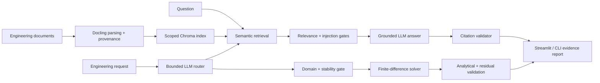

# Physics-Grounded Engineering Copilot

[](https://github.com/Jamal-dev/physics-grounded-engineering-copilot/actions/workflows/ci.yml)

A local, evidence-first AI engineering system that combines scoped RAG, a
bounded LLM agent, and analytical verification of a numerical physics tool.
Docling parses engineering files, ChromaDB stores provenance-preserving evidence,
and Ollama or OpenAI supplies the answer model. A LoRA track adds leakage-aware
training and a measured four-condition evaluation.

The project is intentionally evidence-first: implemented features, training
provenance, held-out measurements, and limitations are reported separately.

For a compact technical review, see the [project card](docs/PROJECT_CARD.md).

## Architecture



## Capabilities and evidence

- Multi-format ingestion with document/page provenance and deterministic IDs
- Isolated evidence scopes, minimum-relevance gating, prompt-injection filtering,
  citation validation, and explicit abstention
- An LLM router whose untrusted JSON can select only scoped RAG or one allowlisted,
  validated simulation tool—never arbitrary Python or shell execution
- A 50-question engineering benchmark with a fixed 35/15 development/test split
- A 144-configuration retrieval study spanning four embeddings, three chunk
  sizes, three overlaps, and four top-k values
- A bounded transient heat-diffusion simulation, deterministic parameter sweeps,
  and verification against a Fourier-series solution
- An optional, leakage-aware LoRA protocol for answer format, citation discipline,
  abstention, and tool routing

## 1. Install the environment

Install Conda and Ollama first, then run these commands from the repository:

```bash
conda env create -f environment.yml
conda activate local-rag
ollama pull llama3.2:3b
ollama pull nomic-embed-text
ollama pull embeddinggemma
ollama pull mxbai-embed-large
ollama pull all-minilm
```

If `local-rag` already exists, update it instead:

```bash
conda env update -n local-rag -f environment.yml --prune
```

Confirm the environment is registered:

```bash
conda info --envs
```

## 2. Run the tool

```bash
./run.sh
```

Open <http://127.0.0.1:8501>. The application listens only on localhost by
default.

Run the test suite and the physics reference case with:

```bash
make test
make physics
```

## 3. Use your documents

Upload one or more supported documents and select **Index selected documents**.
The tool accepts PDF, DOCX, PPTX, XLSX, HTML, Markdown, text, and CSV files.
Assign related documents to one evidence scope; queries never retrieve chunks
from a different scope.

Enter a question and select **Compare answers**. The interface shows:

- **Before RAG:** the model answers from general knowledge without retrieved
  context.
- **After RAG:** the same model answers from passages retrieved from the indexed
  documents, with citations and inspectable evidence.

The opening portion of the general answer is also used as bounded semantic
query-expansion vocabulary. It can help retrieval match the terminology used by
a document, but it is never passed to the final grounded-answer prompt as
evidence. The bound limits contamination from unsupported details in the
ungrounded response.

The poroelasticity example uses this question:

> What is the standard approach to model the poroelastic material?

The local test document is Reint de Boer's *Theory of Porous Media*. That book
is not redistributed by this repository. Place a legally obtained document in
`.local_documents/theory_of_elasticity.pdf`, upload it through the interface, or
set `RAG_EXAMPLE_DOCUMENT` in a local `.env` file.

## Configuration

Copy `.env.example` to `.env` and change only the settings you need:

```bash
cp .env.example .env
```

Common options:

```dotenv
OLLAMA_BASE_URL=http://127.0.0.1:11434
OLLAMA_CHAT_MODEL=llama3.2:3b
OLLAMA_EMBED_MODEL=embeddinggemma
OLLAMA_EMBED_NUM_CTX=2048
RAG_DATA_DIR=.data
RAG_COLLECTION_NAME=document_rag_embeddinggemma_w200_o50_p298_483
RAG_CHUNK_WORDS=200
RAG_CHUNK_OVERLAP=50
RAG_EMBED_DOCUMENT_TITLE=Theory of Porous Media
RAG_EXAMPLE_DOCUMENT=path/to/your/document.pdf
RAG_DEFAULT_SCOPE=default
RAG_MIN_RELEVANCE_SCORE=0.45
RAG_ENABLE_OCR=false
DOCLING_THREADS=8
```

OCR is disabled by default because born-digital PDFs already contain text and
process much faster without it. Set `RAG_ENABLE_OCR=true` for scanned documents.

To offer OpenAI as an alternative answer model, set `OPENAI_API_KEY` and
optionally `OPENAI_MODEL`. Embeddings remain on the configured Ollama embedding
model so one Chroma collection keeps a consistent vector dimension.

## Command-line use

```bash
conda activate local-rag
python cli.py --ingest path/to/document.pdf \
  --scope poromechanics \
  --question "What is the standard approach to model the poroelastic material?"
```

For isolated tests or separate clients, pass `--data-dir` and
`--collection-name` explicitly. These command-line values take precedence over
ambient Conda environment variables.

The CLI prints the before-RAG answer, the document-grounded after-RAG answer,
and the retrieved evidence.

## Adapting the tool

- Change the answer model with `OLLAMA_CHAT_MODEL` or the OpenAI settings.
- Change the embedding model with `OLLAMA_EMBED_MODEL`; always use a new
  `RAG_COLLECTION_NAME` after changing the model, prompts, or chunk settings.
- Use the Streamlit interface as-is or import `ingest`, `ask_without_rag`, and
  `ask` from `rag.py` in another application.
- Set `RAG_DATA_DIR` when persistent indexes should live outside the repository.

## Safety and evidence gates

Retrieved files are treated as untrusted data. Instruction-like passages are
excluded before generation, low-relevance passages are removed, and all numeric
citations are checked against the evidence actually supplied to the model. If
no passage passes those gates—or if the model emits missing or unavailable
citations—the workflow abstains instead of returning an ungrounded answer.

Evidence scopes prevent one customer's or experiment's documents from leaking
into another retrieval context. The relevance threshold is visible and
adjustable in the interface because its calibration depends on the embedding
model and corpus.

## Validated physics tool

The **Physics tool** tab solves one-dimensional transient thermal diffusion with
a stable explicit finite-difference method. It rejects requests outside stated
parameter bounds or above 250,000 steps, and reports:

- achieved Fourier number and stability status;
- relative L2 and maximum error against a Fourier-series solution;
- discrete PDE residual;
- maximum-principle violations; and
- deterministic parameter-sweep results.

The same tool is scriptable:

```bash
python physics_cli.py
python physics_cli.py --sweep 6e-6 1.2e-5 2.4e-5
```

This compact solver is not presented as a general industrial thermal model. It
is an inspectable example of the controls needed when an LLM orchestrates an
engineering simulation.

## Bounded agent workflow

The **Agent workflow** tab asks the local model to select exactly one action:
`answer_from_evidence` or `simulate_thermal_diffusion`. Its JSON is parsed and
validated against a narrow allowlist. Unknown actions, non-numeric values,
unsupported parameters, unstable discretizations, and out-of-domain physics
requests are rejected before execution. Document questions continue through the
same scope, relevance, injection, abstention, and citation gates described above.

## Fine-tune and measure the improvement

The repository now includes a model-agnostic PEFT/LoRA path and a controlled
four-way comparison:

1. base model;
2. base model + RAG;
3. the same base model + fine-tuning; and
4. the same base model + RAG + fine-tuning.

The adapter can be trained on any compatible Hugging Face causal chat model.
The Qwen3/FEM setup is an example YAML rather than model-specific application
code. Start with a data/config validation:

```bash
python -m fine_tuning.train \
  --config fine_tuning/configs/fem_weakform_qwen3.yaml \
  --dry-run
```

After training and indexing the evaluation documents, run the untouched test
split:

```bash
python -m fine_tuning.index_corpus \
  --config fine_tuning/configs/fem_weakform_qwen3.yaml
python -m fine_tuning.evaluate \
  --config fine_tuning/configs/fem_weakform_qwen3.yaml \
  --resume
```

The runner loads one base checkpoint, disables/enables its LoRA adapter, and
reuses one retrieval result for the two RAG conditions. It reports per-variant
metrics plus the fine-tuning effect with and without retrieval and their
interaction. Configure `FINE_TUNE_CONFIG` in `.env` to expose the same four
answers in the Streamlit **Fine-tuning comparison** tab.

Measured on the untouched 48-question test split, token F1 was 9.6% for the
base model, 76.1% for base+RAG, 28.7% for base+fine-tuning, and 87.1% for
base+fine-tuning+RAG. These overlap gains do not imply uniformly better output:
valid JSON fell to 2.1% for fine-tuning alone and 18.8% for the combined system
because many adapter-enabled outputs reached the fixed generation cap. See the
[complete results](results/FINE_TUNING_RESULTS.md) for confidence intervals,
structured metrics, and limitations.

See [the fine-tuning guide](docs/FINE_TUNING.md) for data preparation,
configuration, commands, architecture, and interpretation.

## pycutfem as a computation tool

pycutfem is valuable as an optional numerical verification tool, while RAG
continues to supply documentation and fine-tuning supplies behavior. It should
be exposed through a narrow JSON-schema interface running in pycutfem's own
tested Conda environment, not by giving the model arbitrary Python or shell
execution. See [the pycutfem tool design](docs/PYCUTFEM_TOOL.md) for the
recommended boundary and implementation sequence.

## Retrieval reliability study

The research question for this repository is:

> **How do retrieval choices influence engineering-answer reliability?**

The checked-in benchmark contains 50 paraphrased technical questions with
reviewed document-page labels and short answer summaries. The source passages
are represented by hashes and evidence terms; copyrighted document text and
embedding caches stay outside version control.

The retrieval corpus is the 186-page technical section spanning pages 298–483,
which covers poroelastic formulations, constitutive theory, and applications.
This declared scope keeps the evaluation aligned with the engineering question;
it does not estimate retrieval over the book's historical chapters or appendices.

The experiment evaluates:

| Choice | Values |
|---|---|
| Embedding model | `all-minilm`, `nomic-embed-text`, `embeddinggemma`, `mxbai-embed-large` |
| Chunk size | 200, 400, 800 words |
| Chunk overlap | 0, 50, 100 words |
| Retrieved chunks | k = 1, 3, 5, 10 |

The benchmark is split before evaluation into 35 development and 15 held-out
test questions. Configuration selection uses development evidence Recall@5,
with MRR@5 as the first tie-breaker. The test split is reported only after that
choice, which prevents selecting a configuration because it happened to fit the
final evaluation questions.

### Measured result

The development split selected `embeddinggemma` with 200-word chunks and a
50-word overlap. It achieved 94.3% development evidence Recall@5 and 100.0%
held-out evidence Recall@5 (95% Wilson CI: 79.6%–100.0%, n=15). At k=3, held-out
recall was 93.3% (70.2%–98.8%). These figures measure evidence delivery to the
generator, not answer correctness.

| Held-out k | Evidence Recall | 95% CI | Page Recall | MRR |
|---:|---:|---:|---:|---:|
| 1 | 66.7% | 41.7%–84.8% | 86.7% | 0.667 |
| 3 | 93.3% | 70.2%–98.8% | 100.0% | 0.789 |
| 5 | 100.0% | 79.6%–100.0% | 100.0% | 0.802 |
| 10 | 100.0% | 79.6%–100.0% | 100.0% | 0.802 |

The complete aggregate table, plots, machine-readable selection record, and
executed notebook are checked in under [`results/`](results/) and
[`notebooks/`](notebooks/).

Evidence Recall@k is intentionally stricter than matching a page number. A hit
must retrieve a chunk that both overlaps the labeled page and contains every
reviewed evidence term. Page Recall@k is also reported as a diagnostic because
large chunks can touch the correct page without containing the answer.

The application defaults now use that selected model and chunking strategy in a
configuration-specific Chroma collection. To build the operational index from
the private corpus exported during the study, run:

```bash
python -m experiments.deploy_selected_index --scope poromechanics
```

The earlier Nomic collection is not modified or mixed with the selected model's
vectors. For another corpus, set `RAG_EMBED_DOCUMENT_TITLE`, use a fresh
collection name, and index through the application or CLI.

### Reproduce the experiment

First index your legally obtained source document using the application or CLI.
Then export the private Docling corpus and validate the public labels:

```bash
python -m experiments.export_corpus --source theory_of_elasticity.pdf
python -m experiments.curate_questions
python -m experiments.validate_benchmark
```

Run the complete grid and create the figures:

```bash
python -m experiments.run_retrieval_benchmark
python -m experiments.analyze_results
python -m experiments.build_notebook
python -m experiments.qa_results
```

Embedding matrices are cached under `RAG_DATA_DIR/evaluation/cache`, so an
interrupted run resumes without repeating completed configurations. Published
tables and figures are written to `results/`; the executed analysis notebook is
in `notebooks/`.

### Interpretation

Recall@k measures whether the answer-bearing evidence reaches the generation
stage. It is a necessary condition for a reliable grounded answer, not a direct
measurement of final prose correctness or citation faithfulness. Results from
this single engineering textbook should be revalidated before adopting the same
configuration for a different document collection.

See the [full retrieval study protocol](docs/RETRIEVAL_STUDY.md) for metric
definitions, model-specific prompts, the selection rule, and validity threats.

## Parameter-efficient fine-tuning

The [LoRA track](docs/FINE_TUNING.md) targets behavior rather than
document memorization: structured engineering answers, evidence citations,
abstention, and tool routing. Training and retrieval indexing exclude the
held-out 48-question test split, and private predictions and adapters remain
below `.data/`.

The evaluation compares four systems independently: base model, base+RAG,
LoRA-only, and LoRA+RAG. Aggregate held-out scores and the complete measurement
protocol are published in [the fine-tuning results](results/FINE_TUNING_RESULTS.md).

## Reproducibility and limitations

- `make test` exercises retrieval helpers, benchmark selection logic, security
  gates, and numerical validation.
- `make benchmark && make analyze` regenerates machine-readable results, figures,
  and the executed notebook.
- `.github/workflows/ci.yml` runs linting and tests on every push and pull request.
- `Dockerfile` packages the application while keeping Ollama and persistent data
  outside the container.
- The evaluation currently uses one poromechanics source and lexical evidence
  labels. It measures retrieval evidence delivery, not full semantic answer
  correctness across all engineering domains.
- The local textbook is copyrighted and is never redistributed. Benchmark
  questions, evidence hashes, code, and aggregate results are the only public
  artifacts.
