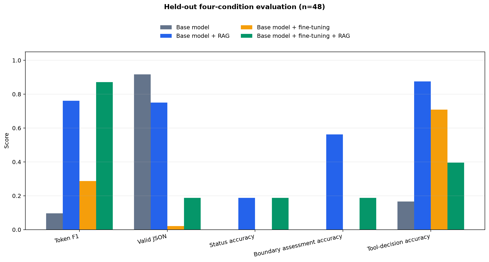

# Fine-tuning and RAG results

These are measured results on the untouched 48-question test split. The LoRA adapter was trained for one epoch on 136 training examples. RAG used three passages from a separate index built only from those same training examples.

| Condition | Token F1 (95% bootstrap CI) | Valid JSON | Status accuracy | Boundary assessment accuracy | Tool-decision accuracy | At token cap |
|---|---:|---:|---:|---:|---:|---:|
| Base model | 9.6% (8.3%–10.9%) | 91.7% | 0.0% | 0.0% (n=48) | 16.7% | 0/48 |
| Base model + RAG | 76.1% (67.1%–84.3%) | 75.0% | 18.8% | 56.2% (n=48) | 87.5% | 8/48 |
| Base model + fine-tuning | 28.7% (26.0%–31.4%) | 2.1% | 0.0% | 0.0% (n=48) | 70.8% | 34/48 |
| Base model + fine-tuning + RAG | 87.1% (84.4%–89.6%) | 18.8% | 18.8% | 18.8% (n=48) | 39.6% | 27/48 |

## Design and interpretation

- Fine-tuning effect without RAG: +0.191 token F1.
- Fine-tuning effect with RAG: +0.110 token F1.
- RAG effect on the base model: +0.665 token F1.
- RAG effect on the fine-tuned model: +0.584 token F1.
- Generation was deterministic. Both RAG conditions received exactly the same retrieved passages per question.
- The test references were not used for training, retrieval indexing, configuration selection, or threshold tuning.
- Many adapter-enabled outputs reached the 384-token generation cap. This explains part of their low JSON-validity score and is a measured failure mode, not a missing result.

Token overlap and structured-field accuracy are useful reproducible signals, but they do not fully establish mathematical equivalence. This is one task collection and one training run; broader conclusions require repeated seeds and expert review of derivations.

